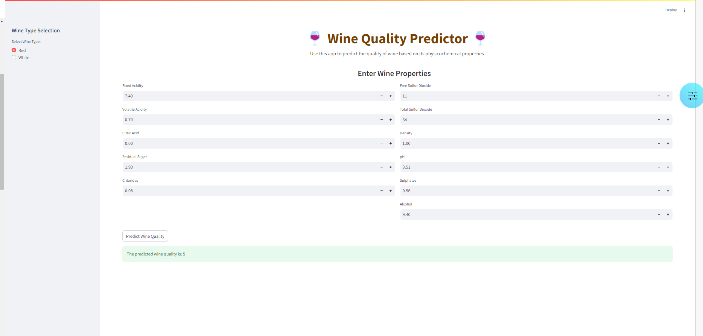

# 🍷 Wine Quality Predictor

## **Overview**
The **Wine Quality Predictor** is a cutting-edge machine learning application designed to predict the quality of red and white wines based on their physicochemical properties. This project showcases the use of advanced data processing techniques, machine learning algorithms, and an interactive web interface built with Streamlit. It is an excellent demonstration of end-to-end AI project development, perfect for portfolios or practical applications.



---

## **Features** 🚀
- 🌟 **Powerful Predictions**: Uses a trained Random Forest model for accurate wine quality predictions.
- 🖥️ **Interactive Interface**: A sleek and intuitive Streamlit web application for user interaction.
- 🧪 **Comprehensive Data Handling**: Processes both red and white wine datasets with SMOTE balancing to handle class imbalance.
- 📊 **Custom Visualization**: Highlights feature importance for better interpretability.
- ⚙️ **CI/CD Pipeline**: Fully automated workflows for testing and deployment using GitHub Actions.

---

## **How It Works** 🛠️
1. **Input**: Users interact with a beautifully designed Streamlit application to input physicochemical properties of wine.
2. **Processing**: The app sends the data to the trained Random Forest model for prediction.
3. **Output**: The app displays the predicted wine quality along with confidence metrics and visual explanations.

---

## **App Features** 🖥️🍷
- **Sidebar Navigation**: Choose the wine type (Red or White) and navigate easily.
- **Dynamic Input Fields**: Input properties like acidity, alcohol, and pH using clean and interactive sliders.
- **Real-Time Prediction**: Get instant predictions after entering the wine's properties.
- **Elegant Visuals**: Includes feature importance plots and a responsive layout for a seamless experience.
- **Error Handling**: Friendly messages guide users in case of invalid inputs or system issues.

---

## **Model Metrics** 📈
The Random Forest model was trained and evaluated using the **Wine Quality Dataset**. Here are some of the key performance metrics:
- **Accuracy**:90%
- **Recall**: 89%
- **F1-Score**: 90%

These metrics highlight the model's strong predictive capabilities across multiple wine quality classes.

---

## **Technologies Used** 🔧
- **Programming Language**: Python (3.9 or later)
- **Machine Learning Frameworks**: scikit-learn, PySpark
- **Web Framework**: Streamlit
- **Version Control**: Git and GitHub
- **Continuous Integration/Continuous Deployment (CI/CD)**: GitHub Actions

---

## **Project Structure** 🗂️
This project follows a modular and professional structure to ensure scalability and readability:
```
Wine-Quality-Predictor/
├── Models/                     # Trained model files
│   └── wine_quality_model.pkl
├── src/                        # Source code
│   ├── data_preparation.py     # Data processing and feature engineering
│   ├── model_training.py       # Model training and evaluation
│   ├── smote_balancing.py      # SMOTE balancing logic
│   ├── feature_importance.py   # Feature importance visualization
│   ├── api.py                  # API for serving predictions
│   └── main.py                 # Main application script
├── data/                       # Dataset files
│   ├── winequality-red.csv
│   └── winequality-white.csv
├── tests/                      # Unit tests
│   ├── test_data_preparation.py
│   ├── test_model_training.py
│   ├── test_smote_balancing.py
│   └── test_feature_importance.py
├── .github/workflows/          # CI/CD workflows
│   └── ci-cd.yml
├── requirements.txt            # Python dependencies
├── app.py                      # Streamlit application
└── README.md                   # Project documentation
```

---

## **Setup Instructions** 🛠️
Follow these steps to set up and run the project on your local machine:

### **1. Clone the Repository**
```bash
git clone https://github.com/bautistao2/Wine-Quality-Predictor.git
cd Wine-Quality-Predictor
```

### **2. Create and Activate a Virtual Environment**
```bash
python -m venv venv
source venv/bin/activate   # On Windows: venv\Scripts\activate
```

### **3. Install Dependencies**
```bash
pip install -r requirements.txt
```

### **4. Run the Streamlit Application**
```bash
streamlit run app.py
```

### **5. Run Tests**
To validate the implementation:
```bash
pytest tests/
```

---

## **Usage Instructions** 🏃‍♂️
1. Open the Streamlit application in your browser (default: `http://localhost:8501`).
2. Use the sidebar to select the wine type (**Red** or **White**).
3. Input the physicochemical properties of the wine using the provided fields.
4. Click **Predict Wine Quality** to get the prediction along with detailed feedback.

---

## **Data Processing Workflow** 🧪
- **Data Preparation**: Combines red and white wine datasets, encodes wine type, and handles missing values.
- **SMOTE Balancing**: Addresses class imbalance to ensure robust predictions.
- **Feature Engineering**: Prepares the data with scaling and encoding for machine learning models.

---

## **Machine Learning Pipeline** 🤖
1. **Random Forest Model**: Trained on balanced data to predict wine quality.
2. **Feature Importance Analysis**: Visualizes the contribution of each feature to the model's predictions.
3. **Evaluation Metrics**: Accuracy, precision, recall, F1-score, and confusion matrix.

---

## **Future Improvements** 🌟
- **Enhanced Model Performance**: Experiment with boosting algorithms like XGBoost or LightGBM.
- **Real-Time Predictions**: Enable real-time streaming data for predictions.
- **Mobile Optimization**: Create a responsive mobile-friendly interface.
- **Additional Datasets**: Expand the training data to include wines from different regions.
- **Feature Analysis**: Add advanced visualizations like SHAP for explainable AI.

---

## **CI/CD Pipeline** ⚙️
This project employs GitHub Actions for continuous integration and deployment:
1. Automatically runs unit tests on every `push` or `pull request` to the `main` branch.
2. Deploys the application to the hosting platform if all tests pass.

---

## **Key Files** 📂
- **`app.py`**: The main Streamlit application for user interaction.
- **`Models/wine_quality_model.pkl`**: The trained Random Forest model.
- **`src/`**: Core scripts for data preparation, model training, and API handling.
- **`tests/`**: Unit tests to validate functionality.
- **`data/`**: Contains the red and white wine datasets.

---

## **Acknowledgments** 🙏
This project is inspired by the **Wine Quality Dataset** from the UCI Machine Learning Repository. Special thanks to the open-source community for their contributions to the libraries and frameworks used in this project.

---

## **Contributing** 🤝
We welcome contributions! Here’s how you can help:
1. Fork the repository.
2. Create a feature branch (`git checkout -b feature-name`).
3. Commit your changes (`git commit -m "Add feature"`).
4. Push to your branch (`git push origin feature-name`).
5. Open a pull request.

---

## **License** 📜
This project is licensed under the MIT License. See the [LICENSE](license.txt) file for details.

---

## **Contact** 📬
For questions, feedback, or suggestions, feel free to reach out:
- **Email**: bautistaosta1@gmail.com
- **GitHub**: [Ilyd Bautista](https://github.com/bautista1)
- **LinkedIn**: [LinkedIn Profile](https://linkedin.com/in/bautita1)

---

Enjoy predicting wine quality with our app! 🍷

